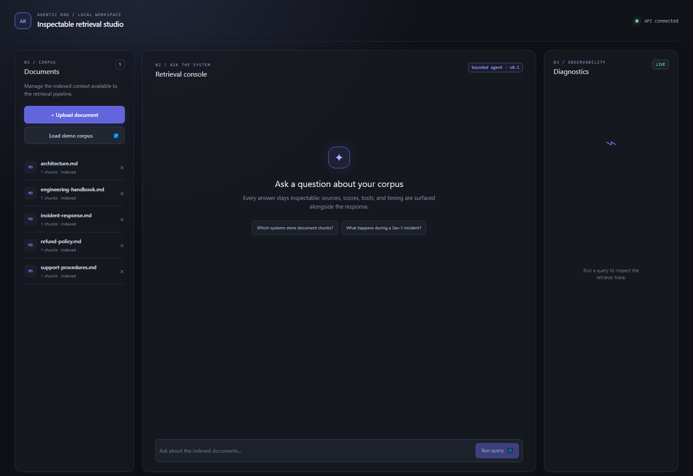
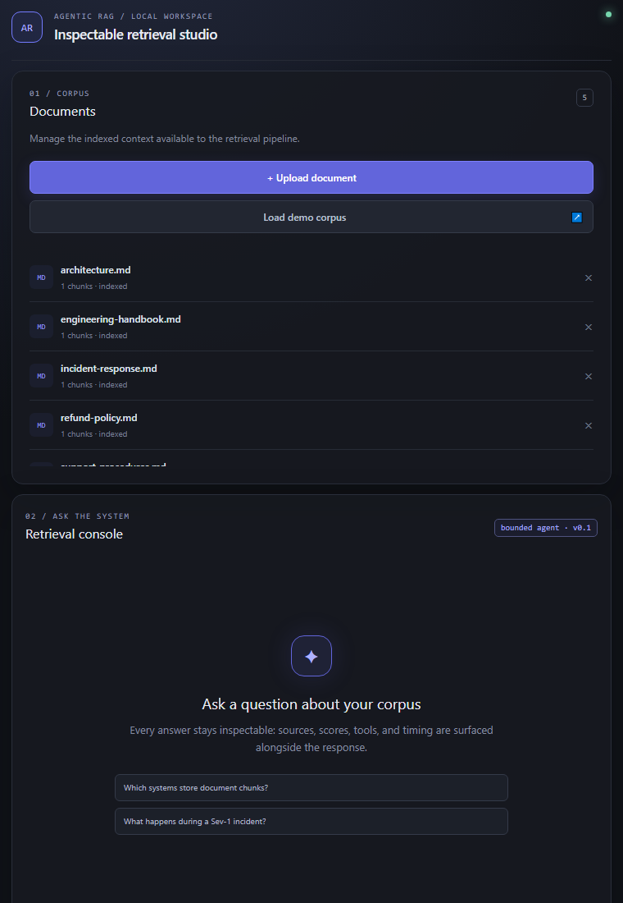
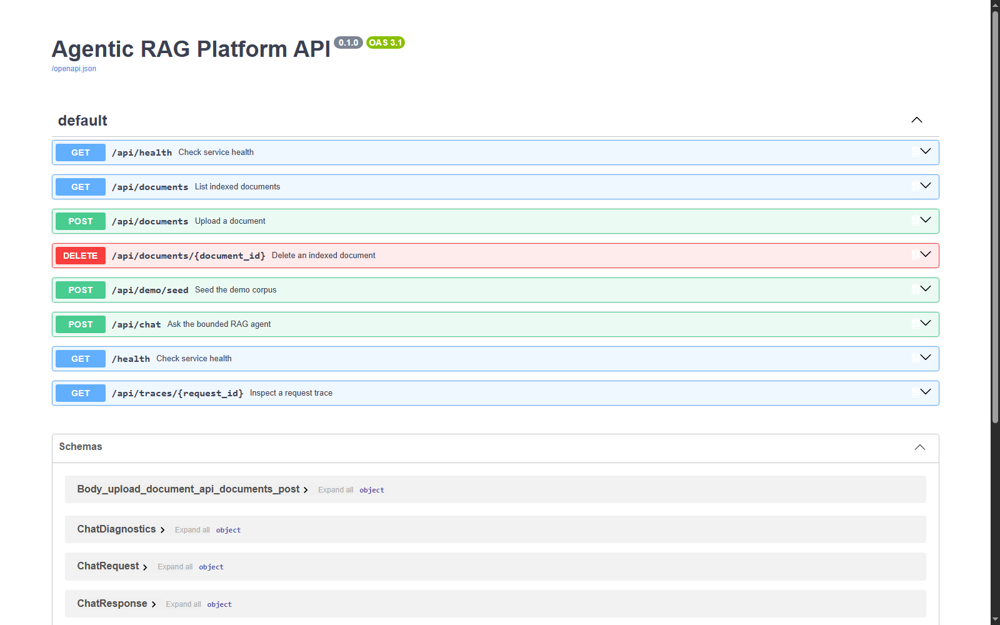
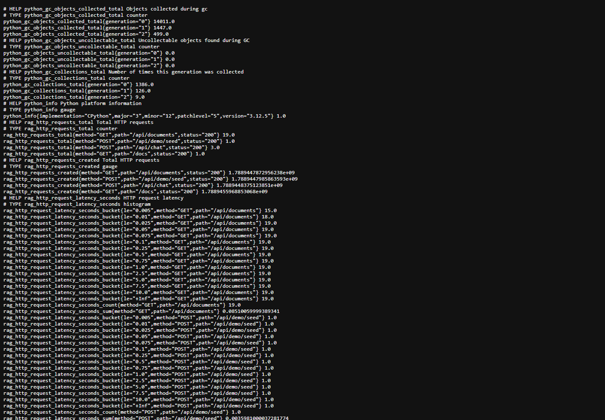

# Agentic RAG Platform

Agentic RAG Platform is a local-first retrieval-augmented generation workspace for answers that can be inspected, reproduced, and troubleshot.

It ingests local documents, persists metadata and chunks in SQLite, indexes embeddings in local Qdrant, combines BM25 and dense retrieval, reranks candidates with a CrossEncoder, and returns answers with citations, tool usage, timings, scores, and request traces.

The default setup runs without a paid LLM account through a deterministic mock provider. An OpenAI-compatible provider is available for integration environments.

## Product capabilities

- **Corpus management:** upload TXT, Markdown, and PDF files, load the five-document demo corpus, inspect chunk counts, and delete documents.
- **Hybrid retrieval:** BM25 lexical retrieval, sentence-transformer embeddings, local Qdrant search, normalized hybrid scoring, and CrossEncoder reranking.
- **Bounded agent:** maximum three iterations and exactly two tools: search_knowledge_base and calculator.
- **Inspectable answers:** structured citations, provider name, retrieved and reranked counts, scores, token estimates, timings, and tools used.
- **Operations:** request IDs, in-process traces, Prometheus metrics, health endpoints, and deterministic evaluation.
- **Quality gates:** pytest, Ruff, TypeScript validation, frontend production build, and CI checks.

## Product screenshots

### Desktop workspace

The desktop view shows corpus management, retrieval console, and diagnostics together.

### Responsive workspace

The responsive view shows the same workflow stacked for a narrower viewport.

### API surface

The Swagger capture shows the implemented health, document, demo seed, chat, and trace endpoints exposed by the backend.

### Prometheus metrics

The metrics capture shows live request counters and latency histograms produced by the running service.

The screenshots are versioned under docs/assets and were generated from the running local application. During live validation I also confirmed:

- Demo seeding inserted five documents and remained idempotent on repeat runs.
- A real retrieval question returned an answer with citations.
- The trace endpoint returned request, retrieval, tool, reranking, and generation stages.
- Prometheus metrics exposed request, latency, ingestion, and error series.
- Calculate 20 / 4 returned The calculator result is 5. without unrelated document citations.
- Documents remained available after a backend restart.
- Deletion removed a document from listing and retrieval; reseeding restored it.

## Architecture

The main architectural trade-offs are recorded in [docs/adr/README.md](docs/adr/README.md).

~~~mermaid
flowchart LR
    Browser[React + TypeScript workspace] -->|HTTP /api| API[FastAPI]
    API --> Ingest[Ingestion routes]
    API --> Chat[Chat route]
    API --> Obs[Health, traces, metrics]
    Ingest --> SQLite[(SQLite metadata and chunks)]
    Ingest --> Qdrant[(Local Qdrant vectors)]
    Chat --> BM25[BM25 lexical retrieval]
    Chat --> Dense[Sentence-transformer vectors]
    BM25 --> Hybrid[Normalized hybrid ranking]
    Dense --> Hybrid
    Hybrid --> Rerank[CrossEncoder reranking]
    Rerank --> Agent[Bounded orchestrator]
    Agent --> Tools[Search and calculator tools]
    Agent --> Provider[Mock or OpenAI-compatible provider]
~~~

The detailed request flow is documented in docs/architecture.md.

## Repository layout

~~~text
backend/                 FastAPI service and domain code
backend/app/agents/      bounded orchestration and tools
backend/app/api/         API routes
backend/app/db/          SQLAlchemy models and runtime database
backend/app/evaluation/  deterministic retrieval benchmark
backend/app/llm/         provider implementations
backend/app/observability/metrics, middleware, and traces
backend/app/rag/         ingestion, retrieval, ranking, and runtime models
backend/tests/           backend unit and integration tests
frontend/src/            React application, API client, and styling
docs/                    architecture, roadmap, specification, and screenshots
~~~

## Requirements

- Python 3.11+
- Node.js 20+
- npm 10+
- Disk space for embedding and reranker model caches

The first real ingestion or chat request may download the configured Hugging Face models.

## Installation

### Windows PowerShell

~~~powershell
git clone https://github.com/PdrPaez/agentic-rag-platform.git
cd agentic-rag-platform
python -m venv backend\.venv
backend\.venv\Scripts\Activate.ps1
python -m pip install --upgrade pip
python -m pip install -e ".\backend[dev]"
cd frontend
npm ci
~~~

### macOS or Linux

~~~bash
git clone https://github.com/PdrPaez/agentic-rag-platform.git
cd agentic-rag-platform
python3 -m venv backend/.venv
source backend/.venv/bin/activate
python -m pip install --upgrade pip
python -m pip install -e './backend[dev]'
cd frontend
npm ci
~~~

## Run locally

Use two terminals from the repository root.

### Backend

~~~powershell
cd backend
.venv\Scripts\Activate.ps1
python -m uvicorn app.main:app --reload --host 127.0.0.1 --port 8000
~~~

On macOS or Linux, activate the environment with source .venv/bin/activate.

### Frontend

~~~powershell
cd frontend
npm run dev
~~~

Open http://127.0.0.1:5173.

The backend exposes API at http://127.0.0.1:8000, Swagger UI at http://127.0.0.1:8000/docs, health at http://127.0.0.1:8000/health, and metrics at http://127.0.0.1:8000/metrics. Vite proxies /api to the backend.

## How to use the tool

### 1. Load the demo corpus

Open the frontend and click **Load demo corpus**. Five reference documents should appear in Documents. The operation is safe to repeat and does not create duplicates.

### 2. Index a document

Click **Upload document**, choose a TXT, Markdown, or PDF file, and wait for the indexing message. The file and chunk count will appear in the corpus panel.

### 3. Ask a question

Enter a question or choose a suggestion, click **Run query**, read the answer, and inspect the citation cards. Each citation includes the source document and excerpt used by the answer.

### 4. Inspect diagnostics

After a query, Diagnostics shows the request ID, total latency, retrieval latency, provider, chunk counts, score bars, estimated tokens, tools, and trace stages.

### 5. Test the calculator

Enter Calculate 20 / 4. The expected result is The calculator result is 5. The request should use the calculator tool and return no unrelated document citations.

### 6. Delete a document

Use the delete action beside a document and confirm the browser prompt. The document is removed from SQLite and Qdrant. Demo documents can be restored with Load demo corpus.

## API reference

All application routes are under /api.

| Method | Route | Purpose |
| --- | --- | --- |
| GET | /api/health | Service health check |
| GET | /api/documents | List indexed documents |
| POST | /api/documents | Upload and index a document |
| DELETE | /api/documents/{document_id} | Delete a document and its vectors |
| POST | /api/demo/seed | Seed the bundled corpus |
| POST | /api/chat | Run bounded retrieval and answer generation |
| GET | /api/traces/{request_id} | Read the request trace timeline |
| GET | /api/metrics | Prometheus metrics |

Health and metrics are also available at /health and /metrics.

Example chat request:

~~~powershell
$body = @{ question = "Which systems store document chunks?" } | ConvertTo-Json
Invoke-RestMethod -Method Post -Uri http://127.0.0.1:8000/api/chat -ContentType "application/json" -Body $body
~~~

## Configuration

The backend reads environment variables from backend/.env.

| Variable | Default | Description |
| --- | --- | --- |
| BACKEND_HOST | 127.0.0.1 | Bind address |
| BACKEND_PORT | 8000 | Bind port |
| CORS_ORIGINS | local Vite origins | Allowed browser origins |
| DATABASE_URL | sqlite:///./data/agentic_rag.db | SQLite connection |
| VECTOR_STORAGE_PATH | ./qdrant_storage | Local Qdrant storage |
| EMBEDDING_MODEL_NAME | sentence-transformers/all-MiniLM-L6-v2 | Embedding model |
| RERANKER_MODEL_NAME | cross-encoder/ms-marco-MiniLM-L-6-v2 | Reranking model |
| LLM_PROVIDER | mock | mock or openai_compatible |
| LLM_MODEL_NAME | gpt-4o-mini | Provider model |
| LLM_API_KEY | unset | Provider key |
| LLM_BASE_URL | https://api.openai.com/v1 | Provider base URL |
| RETRIEVAL_CANDIDATE_COUNT | 12 | Candidate pool size |
| FINAL_CONTEXT_COUNT | 5 | Final context size |
| LEXICAL_WEIGHT | 0.4 | BM25 contribution |
| VECTOR_WEIGHT | 0.6 | Vector contribution |
| CHUNK_SIZE | 800 | Characters per chunk |
| CHUNK_OVERLAP | 150 | Character overlap |

## Validation

~~~powershell
cd backend
python -m pytest -q
python -m pytest --cov=app --cov-fail-under=85 -q
python -m ruff check app tests
python -m app.evaluation.run

cd ..\frontend
npm run lint
npm run build
~~~

The evaluation compares BM25, vector, hybrid, and hybrid-plus-reranking retrieval using Hit@1/3/5, Recall@5, MRR, normalized expected-fact coverage, and average/p50/p95 latency. The latest generated values are committed in [docs/evaluation/latest.md](docs/evaluation/latest.md). Fact coverage is normalized text matching for the controlled dataset, not semantic factuality evaluation.

## Development report

I built this project as a small but complete foundation for inspectable RAG workflows. My priority was to keep the important boundaries visible: where documents are stored, how retrieval is combined, which tools can run, what context reaches the provider, and how a response can be traced afterwards.

I started with a local FastAPI service, SQLite metadata, local Qdrant vectors, and a React client. I then added ingestion, chunking, hybrid retrieval, reranking, bounded orchestration, structured citations, a calculator tool, and a deterministic mock provider. The mock provider keeps the full workflow usable without an external API key while preserving an integration path for an OpenAI-compatible service.

I added request-level observability so each chat request has a request ID and exposes retrieval, tool, reranking, and generation stages. The UI surfaces the same information instead of hiding it in server logs. Prometheus metrics and a deterministic evaluation runner provide repeatable checks for retrieval changes.

I designed the frontend as an operational workspace rather than a generic chat screen. Corpus management, retrieval, and diagnostics are visible as separate working areas. During the visual pass I fixed citation overflow, added responsive layouts, improved focus states, added loading feedback, and made error messages more visible.

I validated the complete flow against a running backend and frontend. The validation covered model loading, demo seeding, idempotence, retrieval with citations, trace retrieval, metrics, calculator execution, restart persistence, deletion, and reseeding. The automated checks currently include 52 passing backend tests, a clean Ruff run, 91% backend coverage, deterministic evaluation, and successful frontend lint and production build.

The implementation was promoted through:

~~~text
feature/ARAG-026-visual-polish -> dev -> main
~~~

The visual polish release is recorded in commits 3828b5c and c47d2c2.

## Engineering decisions and limitations

- SQLite and local Qdrant keep the system runnable on a developer machine.
- The trace store is in-process and intended for local diagnostics, not distributed production observability.
- The mock provider is deterministic and useful for development, but it is not a replacement for production model evaluation.
- The retrieval benchmark uses a controlled corpus and normalized text matching.
- Authentication and multi-tenant isolation are not implemented yet.

The security boundary and prompt-injection limitations are documented in [docs/security.md](docs/security.md). The chat API also reports whether each response is grounded in retrieved context, lacks sufficient context, or comes from the calculator tool.
- Ingestion and vector indexing are synchronous.
- Model caches and runtime data are environment artifacts and should not be committed.

## Roadmap and contribution workflow

The source roadmap is in docs/roadmap.md. The canonical requirements are in docs/implementation-specification.md.

The repository workflow is:

~~~text
feature/* or fix/* -> dev -> main
~~~

Commit format:

~~~text
[AREA][ARAG-XXX] concise description
~~~

Before promotion, run backend tests and Ruff, frontend lint and build, and update documentation when behavior or API contracts change.

## License

No public license has been declared. Treat this repository as internal software unless a separate license is provided.
