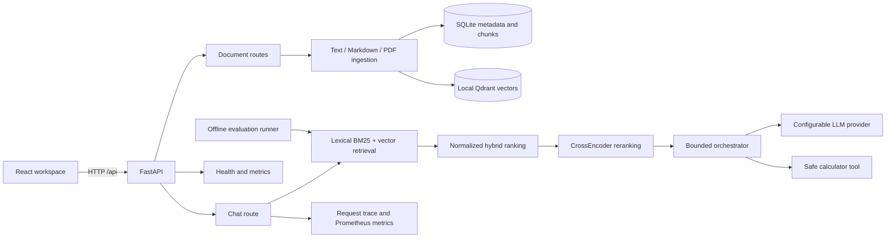

# Agentic RAG Platform architecture

The platform is a small, local-first RAG system with inspectable boundaries. A Vite React client talks to a FastAPI API; the backend persists document metadata and chunks in SQLite, stores embeddings in a local Qdrant collection, and exposes retrieval, orchestration, tracing, metrics, and evaluation capabilities.



## Request flow

1. `POST /api/documents` extracts supported text, chunks it, writes metadata and chunks to SQLite, then embeds and upserts chunks into local Qdrant. `POST /api/documents/demo/seed` loads the five bundled documents idempotently. `GET` lists indexed documents and `DELETE` removes both relational and vector records.
2. `POST /api/chat` rebuilds the lexical index from persisted chunks, retrieves lexical and vector candidates, normalizes and combines scores, and reranks the candidates.
3. The bounded orchestrator can use the calculator when a question requires arithmetic, then asks the configured provider for a structured answer. The response includes citations and diagnostics.
4. Middleware assigns a request ID and records request metrics. Chat diagnostics report retrieval, reranking, generation, token estimates, provider, tools, scores, and timings. `GET /api/traces/{request_id}` returns the in-process trace timeline.

The health and metrics routes are available both at `/health` and `/api/health`, and at `/metrics` and `/api/metrics`, so local development and the documented API prefix remain compatible.

## Retrieval design

Lexical retrieval uses BM25 over tokens from persisted chunks. Vector retrieval uses normalized sentence-transformer embeddings and cosine similarity in Qdrant. Hybrid ranking applies configurable lexical/vector weights after min-max normalization. A CrossEncoder reranker scores the hybrid candidate texts before the final context is selected.

The evaluation command (`python -m app.evaluation.run`) uses a controlled five-document corpus and 30 cases, including a 20% negative slice for abstention behavior. It computes vector-only, hybrid, and hybrid-plus-reranking Hit Rate@5 and MRR, as well as deterministic expected-fact coverage and average latency. Fact coverage is normalized text matching for this controlled corpus; it is not semantic factuality evaluation. Backend tests also exercise deterministic answer-behavior checks for abstention, citation presence, and expected-fact coverage.

## Frontend boundaries

The UI has three intentionally visible areas:

- Corpus management: upload `.txt`, `.md`, or `.pdf` files, load the demo corpus, list chunk counts, and delete documents.
- Retrieval console: submit questions, preserve conversation history, and show answer citations beside each response.
- Diagnostics: expose request IDs, provider, tools, candidate counts, latency stages, token estimates, score bars, and a trace timeline.

The Vite development server proxies `/api` to `http://127.0.0.1:8000`. The production build is static and expects the API to be served under the same origin or routed by the deployment environment.

## Local validation

```powershell
cd backend
python -m pip install -e ".[dev]"
python -m pytest
python -m ruff check app tests
python -m app.evaluation.run

cd ..\frontend
npm ci
npm run lint
npm run build
```

No paid LLM key is required for the default mock provider. Embedding and reranking model downloads may be required on the first real ingestion or chat request.
