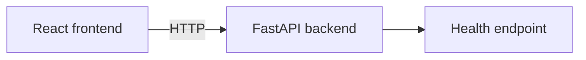

# Architecture

The current implementation is intentionally thin: a Vite React client calls a FastAPI backend. Future RAG components should be introduced as focused modules with observable boundaries and tests.

This document describes only implemented components; ingestion, retrieval, models, and agent orchestration are not present yet.

